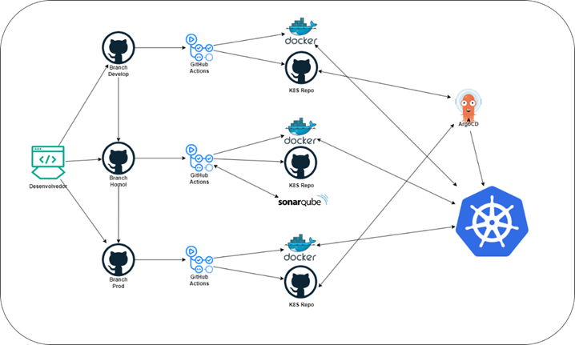

**Implementação de Pipeline CI/CD**

Para esse desafio vou utilizar as ferramentas que mais estou familiarizado.
•	GitHub Actions
Ferramenta que faz parte da plataforma do GitHub, vamos utilizar o Actions para ser o Motor da nossa esteira dentro dele podemos configurar o build de um artefato após o commit do desenvolvedor.
•	Argo CD
O Argo CD é uma ferramenta de GitOps, ele é responsável por garantir que o nosso artefato esteja deployado em nosso cluster kubernetes exatamente da maneira que orientamos ele via código.
•	Sonarqube
Vamos utilizar o sonarqube como uma ferramenta de teste, o sonarqube é responsável por fazer uma varredura em todo o código e apontar falhas de segurança e erros de código.
•	Segue abaixo o Diagrama do nosso projeto.

Esse diagrama representa uma esteira simples de CI/CD porém muito eficiente e muito utilizada em diversas empresas.
    
•	A partir do commit do nosso desenvolvedor na Branch de Develop, nosso workflow é ativado acionando o github actions, ao acionar o Actions ele realiza o checkout da Branch para dentro de uma VM Linux, onde ele cria uma TAG 0.1, após a criação da TAG ele faz o download de algumas libs necessárias para rodar o Docker, concluindo a instalação das libs ele faz um check para verificar se o path X da Branch de Develop é diferente do Path X da Branch de Homolog, caso o valor seja verdadeiro ele parte para a próxima etapa que é o build do artefato em questão.

•	Após o Build, temos o step de enviar o código ao Sonarqube onde ele é validado e atribuído uma nota a ele, com o código aprovado pelo sonarqube enviamos o artefato ao DockerHub com um Push, o próximo step é salvar a nova TAG gerada dentro de um arquivo Kustomize dentro do Repo do Kubernetes.
Com o a TAG atualizado dentro do Repo do Kubernetes o ArgoCD entra em ação, o ArgoCD faz uma verificação periódica de todos os arquivos de Kind do Repositorio do Kubernetes para ver se houve alguma modificação, o ArgoCD vai identificar a alteração da Tag e vai implantar o novo Artefato no namespace projetox-develop.

•	Com o ambiente de Develop no ar, e com as devidas aprovações vamos ao merge em homolog com os testes da área de negócio, com a aprovação da área de negocio vamos ao merge para o ambiente de Produção, as etapas de build push e deploy do ArgoCD se repetem para os outros Enviroments, lembrando que todos os deploys feitos pelo ArgoCD vao ser orquestrados pelo Argo Rollouts uma ferramenta de Deploy, eu gosto de utilizar o método Blue-Green ou o Canary.

