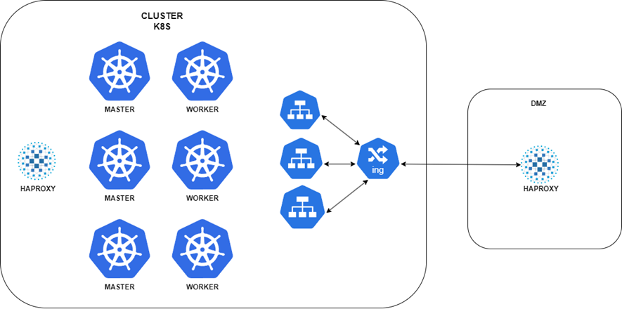
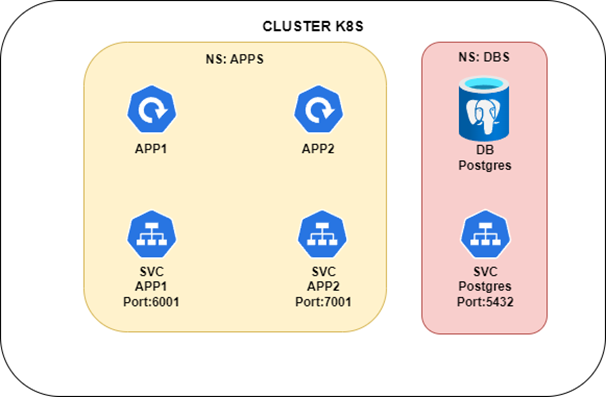

**Arquitetura de Kubernetes**

O diagrama abaixo é referente a um Cluster com 3 Masters, 3 Workers e 2 servidores HAPROXY, o Primeiro servidor HAPROXY serve como balance do cluster kubernetes, para os Nodes se comunicarem entre si, o Segundo HAPROXY serve como um balance em uma zona DMZ, onde todas as requisições externas para aplicações dentro do K8S vao ser tratadas.
Cluster com 6 Nodes, o mínimo de masters que um cluster de k8s pode ter é 3, e podemos aumentar ele sempre que necessário porem a quantidade de Masters sempre deve ser um numero Impar 3,5,7...
Na segunda imagem vemos um contexto interno do k8s contendo dois namespaces um com o nome apps onde temos dois exemplos de aplicações com os seus respectivos serviços e outro namespace com o nome DBS onde vamos deixar todos os nossos bancos de dados, a comunicação entre o app1 do ns apps e o ns dbs é feita via requisição interna do cluster, por padrão a requisição é http, sendo possível chegar até o banco postgres que tem um nome DNS http://postgres.dbs.svc.cluster.local:5432.
Para o balance dos nodes Workers vou utilizar um exemplo de cluster onprimes, onde para fazer a configuração da rede interna utilizamos calico e MetalLB, com o metalLB configuramos um pool de ips virtuais, nesses ips virtuais podemos configurar nossos ingress utilizando nginx ou kong, com o serviço de MetalLB vamos ter uma distribuição por igual das chamadas do ingress dependendo claro do numero de replicas que nosso deployment vai possuir e como esta configurado o nodeselect dele.
Para uma configuração segura dentro e fora do k8s vamos utilizar alguns conceitos simples, dentro do k8s vamos bloquear o trafico entre namespaces, permitindo que um namespace x converse com um y somente se liberado via networkpolicy, para a proteção externa do Cluster vamos deixar o nosso cluster em uma rede 10.0.0.0/22 e criar uma dmz na rede 192.168.1.1/24, dentro dessa dmz vamos criar um servidor HAPROXY onde vamos colocar nossas regras para o HAPROXY se comunicar com o ingress.

