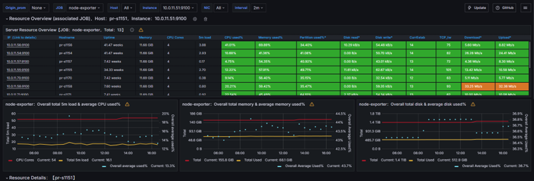
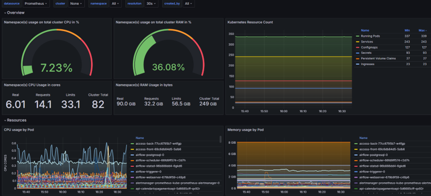

**Dashboard Infraestrutura K8S**

Nos dois dashboards abaixo, temos o resource utilizado por cada Node como memoria, CPU, Disco, I/O e Rede, temos também um exemplo de Dash para monitoramento interno
do kubernetes onde monitoramos deployment por deployment, todos eles possuem filtros onde você pode selecionar o namespace ou o Node que você quer para poder verificar mais
afundo o comportamento dele.

Os Dashboards foram elaborados tendo em mente saber as principais métricas de infraestrutura que estamos utilizando, é altamente recomendado monitorar não somente o cluster 
como um todo mas também cada workload do seu cluster, pois podemos colocar requests iniciais em nosso workload que é maior que o consumo médio dele, sendo assim vamos estar
entregando mais recurso do o workload realmente consome, acredito que esses dashboards sejam o suficiente vendo o lado de infraestrutura, porem podemos ir além com dashboards
voltado a observabilidade do workload, podemos observar  todos os requests feito em uma aplicação durante o dia para medirmos o horário onde mais acontece e aumentar ou
diminuir o recursos deles nesse período, um bom exemplo é deixarmos em standby nodes de k8s durante o período da noite pois normalmente o consumo é menor, em um cenário
de cloud isso é altamente recomendado.

Acredito que a opção C não é uma pergunta mais sim um adendo, com tudo vou citar as ferramentas que tenho trabalhado nesse mundo da observabilidade, desde o início de minha 
trajetória de TI utilizo o Zabbix para monitoramento de infraestrutura onprimes, após começar a utilizar o K8S comecei a utilizar o Prometheus pois é altamente compativel com 
kubernetes, após algum tempo aprendendo Kubernetes me deparei com problemas em aplicações onde precisei aprender ser OpenTelemetry, onde trato Metricas Logs e traces, confesso 
que meu conhecimento nessa ferramenta ainda é baixo mas já implementei ela em praticamente todos os workloads da minha empresa em diversos tipos de linguagem.

